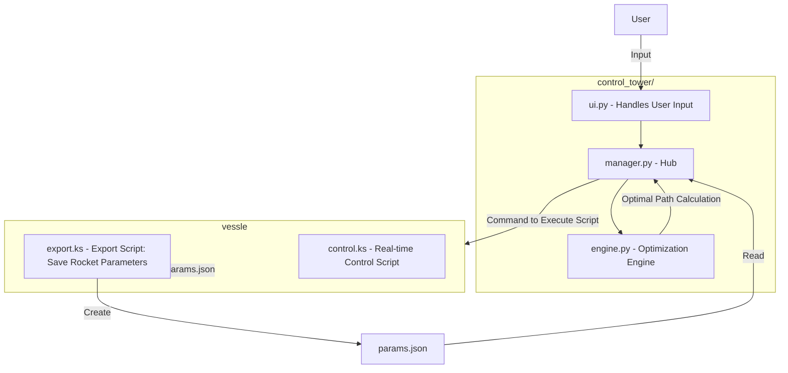

# System Architecture Map

<!-- Note: To avoid rendering errors in Mermaid diagrams, avoid using parentheses in node labels. Use alternative delimiters like colons or dashes instead. -->

<!-- Philosophy: The architecture is based on a file/path structure. Every structural entity is represented as a file or a directory. -->

