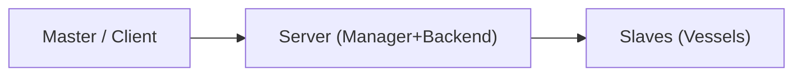
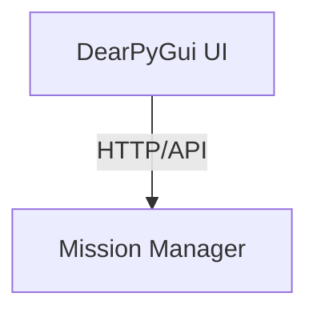
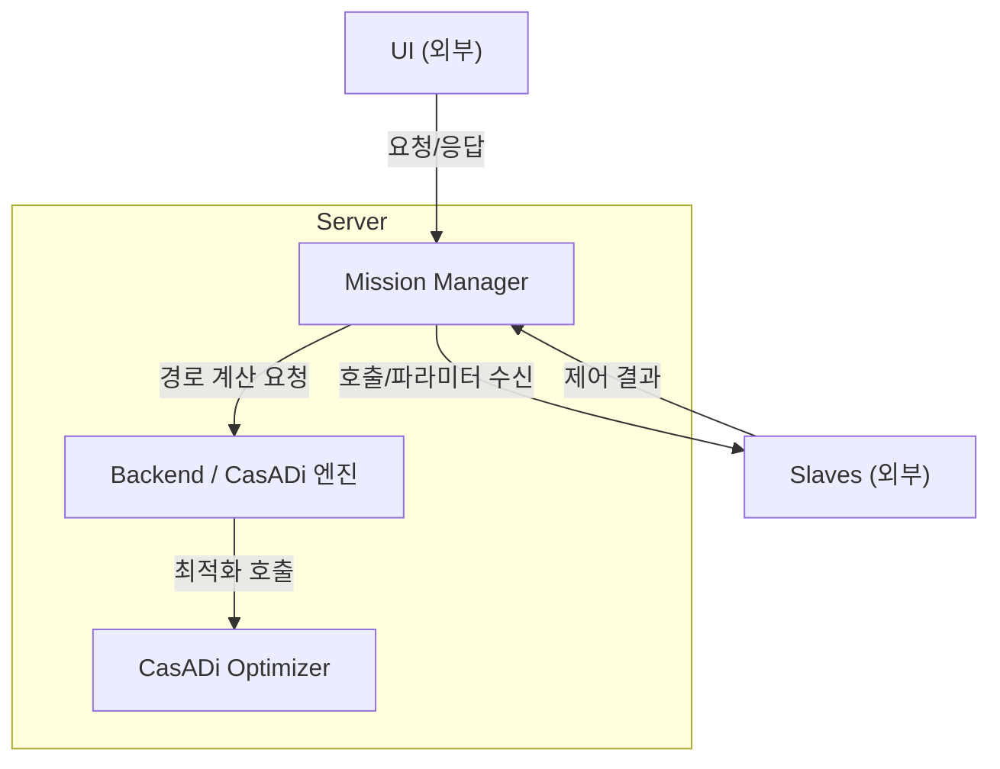
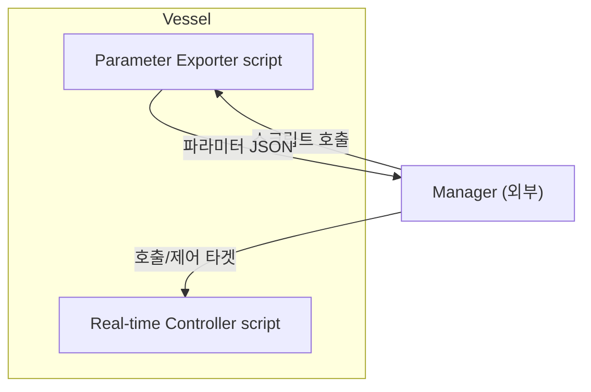

# 1축 제어 시스템 아키텍처

## 시스템 구조 다이어그램

### 1. 전체 시스템 개요

```mermaid
graph LR
    Master["Master / Client"]
    Server["Server (Manager+Backend)"]
    Slaves["Slaves (Vessels)"]

    Master --> Server
    Server --> Slaves
```

### 2. 서브시스템 내부 구조

#### 2.1 Master / Client (UI)

```mermaid
graph TB
    UI[DearPyGui UI]
    UI -- HTTP/API --> Manager[Mission Manager]
```

#### 2.2 Server 내부

```mermaid
graph TB
    subgraph Server
        direction TB
        Manager[Mission Manager]
        Backend[Backend / CasADi 엔진]
        CasADi[CasADi Optimizer]
    end

    UI["UI (외부)"] -->|"요청/응답"| Manager
    Manager -->|"경로 계산 요청"| Backend
    Backend -->|"최적화 호출"| CasADi
    Manager -->|"호출/파라미터 수신"| Slaves["Slaves (외부)"]
    Slaves -->|"제어 결과"| Manager
```

#### 2.3 Slave (Vessel) 내부

```mermaid
graph TB
    subgraph "Vessel" 
        ParamsExporter[Parameter Exporter script]
        Controller[Real-time Controller script]
    end

    Manager["Manager (외부)"] -->|"스크립트 호출"| ParamsExporter
    Manager -->|"호출/제어 타겟"| Controller
    ParamsExporter -->|"파라미터 JSON"| Manager
    
```

